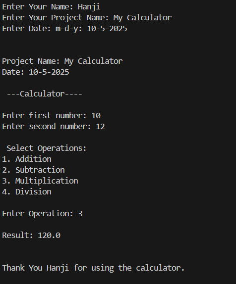

# Simple Calculator Program (Python)

---

## Project Overview
This project is a **Simple Calculator** built using **Python** that performs basic arithmetic operations such as **addition, subtraction, multiplication, and division**.  
It serves as an introductory project to strengthen programming logic, input handling, and function design — ideal for **beginners learning Python**.

---
 
## Features
Perform the four basic math operations:  
- Addition (`+`)  
- Subtraction (`-`)  
- Multiplication (`*`)  
- Division (`/`)  

User-friendly and interactive console-based interface  
Error handling for invalid inputs (like dividing by zero or entering non-numeric values)

---
 
## Code Structure

Pythons/
   └── MyFirst_Calculator/
          ├── calculator.py
          ├── README.md
          
---
 
##  How It Works
1. The program displays a menu with arithmetic operations.  
2. The user selects an operation by entering its corresponding symbol.  
3. The program asks for two numbers.  
4. It performs the calculation and prints the result.  
5. The process repeats until the user chooses to exit.

---
 
## How to Run
### Option 1: Run via Command Line

 calculator.py

### Option 2: Run via VS Code

1. Open the project folder in VS Code.
2. Open calculator.py.
3. Click ▶ (Run button) or press Ctrl + F5.

#### Example Output

---
 
## Requirements

- Python 3.8 or higher
- Any IDE or text editor (VS Code recommended)

---
 
## Learning Goals

This project helps beginners practice:
- Basic syntax and variables
- Conditional statements (if-else)
- User input handling
- Functions and return values
- Loop control (while)

---

## Future Enhancements
1. Add exponentiation and modulus operations
2. Implement GUI version using Tkinter
3. Include unit testing for each operation

--- 

## Author
Fahad Hadji Esmael
2nd-Year | IT Student 
Polytechnic University of the Philippines

---

## License
This project is open-source and free to use for educational purposes.