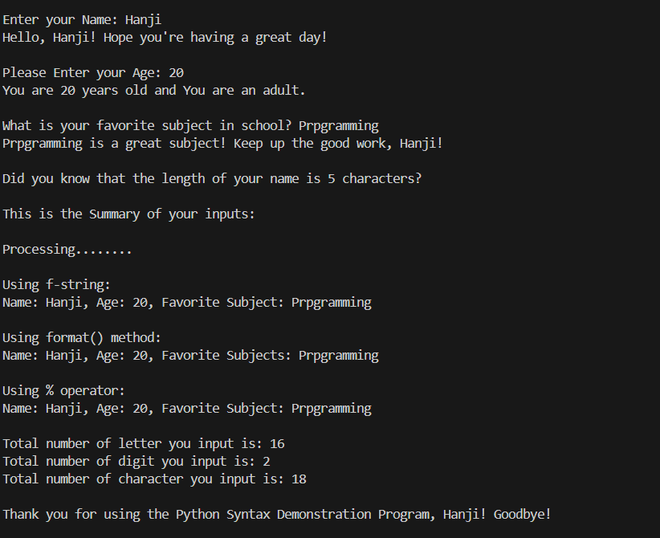

# Python Syntax 

---

## Project Description
This beginner-friendly project lets you explore and apply the fundamentals of Python syntax.  
It includes variables, identifiers, indentation, input/output, multi-line statements, comments, docstrings, and string formatting.  
You’ll build an interactive program that demonstrates all these concepts together — perfect for solidifying your understanding of Python basics.

---
## Project Required Output
- When executed, the program should:
- Ask for your name and age
- Compare the age with 18 and print the condition
- Display the data type of each input
- Calculate and print the area of a square
- Demonstrate string formatting methods (format, f-string, %)
- Include a short delay using time.sleep()
- Print a final summary

---

## Concepts Used
- Python Identifiers and Variables  
- Data Types and Type Checking  
- Indentation and Code Blocks  
- Conditional Statements (`if`, `elif`, `else`)  
- Functions and Docstrings  
- String Formatting (`format()`, f-string, `%`)  
- Wait Time using `time.sleep()`  

---

## How to Run
1. Clone this repository or download the folder.  
2. Open it in **VS Code** or your preferred Python IDE.  
3. Run the script.
4. Follow the on-screen instructions to test all interactive parts.

---

## Code Structure

Pythons/
   └── Python_Syntax/
          ├── main.py
          ├── image.png
          ├── README.md

---

## Sample Output

---

## Author
Fahad Hadji Esmael
2nd-Year | IT Student 
Polytechnic University of the Philippines

---

## License
This project is open-source and free to use for educational purposes.